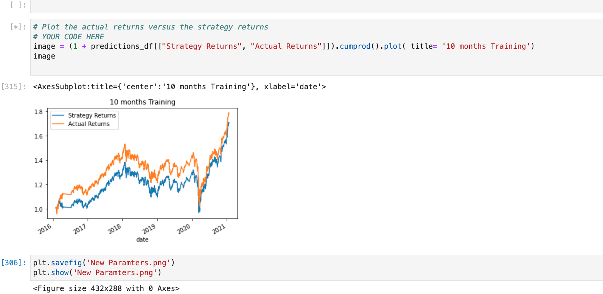

# Algo_trading_homework

I created a baseline performance using SVM and trainning the data over 3 months  
Initial accuracy was 0.64  

   
  

I altered the training period to 10 months with worsening results   
Acccuracy decreased to 0.55
           
             

I increased the training period to 30 months with slightly better results   
Accuracy was 0.57<b>

 
        

I again changed the moving averages to 10 & 65  periods for long and short SMA 
Training period was 3months and accuracy improved to 0.63  

  
    

Finally i added 3 imput parameters 
 1. SMA fast minus close shifted by 1 period 
 2. Close - SMA Slow shifted by 1 period  
 3. Multipied both parameters above shifted by 1 period  

Acurracy increased to 0.67 
          
            

Finally i used a new classifier Logistic regression this had an accuracy of 0.52
            

## Conclusion 
  
### The SVM model performed better than Logistic regression 
### The training period was better at 3 months. 
### Adding new parameters provided improved accuracy

